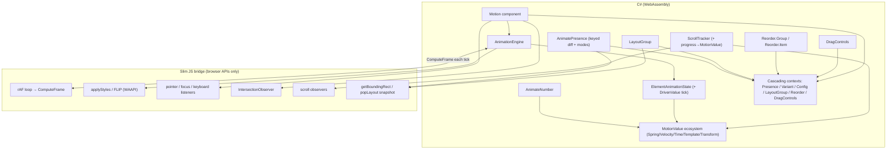

# Design Document: Motion Parity Improvements

## Overview

BlazorMotion is a Blazor-native animation library inspired by Motion for React (formerly Framer Motion). Its defining architectural choice is a **C# `AnimationEngine`** that runs all animation math in WebAssembly, paired with a **slim JavaScript bridge** (`blazor-motion.js`) that only touches browser-native APIs: the `requestAnimationFrame` loop, DOM style mutation, pointer/focus event listeners, `IntersectionObserver`, scroll observation, and Web Animations API FLIP.

This design extends the library toward closer feature parity with Motion for React across twelve prioritized areas spanning three categories: **bug fixes** in existing code (`AnimatePresence` wait-mode and keyed diffing, shared-element `LayoutId` transitions), **new components** (`LayoutGroup`, `Reorder`, `AnimateNumber`), **gesture enhancements** (keyboard-accessible tap, nested-tap propagation, drag controls), a **richer MotionValue ecosystem** (spring-driven values, velocity, time, templates, multi-input transforms, change events), and **orchestration/scroll** improvements (stagger `from`/`direction`, scroll-linked progress bound to a `MotionValue`).

The design strictly preserves the existing API conventions — `AnimationProps`, `TransitionConfig`, `AnimationTarget`, `MotionVariants`, cascading contexts (`PresenceContext`, `VariantContext`, `MotionConfigContext`), and the `RegisterElement`/`ComputeFrame`/`Tick` engine contract — so that all additions feel native to the library and require no breaking changes. Every new capability keeps animation math in C# and limits JavaScript to the minimal browser-API surface already established.

## Goals & Non-Goals

**Goals**
- Make `AnimatePresence` support `wait`/`sync`/`popLayout` modes and keyed multi-child diffing.
- Wire shared-element (`LayoutId`) "magic motion" transitions through the existing FLIP path.
- Add `LayoutGroup`, `Reorder`, and `AnimateNumber` components.
- Make tap gestures keyboard accessible and support nested-tap `Propagate`.
- Add a drag-controls handle for manually starting drags and snap-to-cursor.
- Expand the `MotionValue` ecosystem (spring, velocity, time, template, multi-input transform, change events).
- Add stagger `from`/`direction` orchestration options.
- Bind scroll progress to a `MotionValue` (not only `WhileInView`).

**Non-Goals**
- Rewriting the animation math drivers (`SpringDriver`, `TweenDriver`, etc.) — they are reused as-is.
- Moving animation logic into JavaScript — the C#-engine boundary is preserved.
- SSR/prerender FLIP support beyond the existing best-effort initial-style emission.
- 3D/WebGL features outside Motion for React's DOM scope.

## Architecture

The improvements layer onto the existing engine without changing its core loop. New C# coordination types (presence diffing, layout group registry, reorder ordering, drivenvalue ticking) live in or beside the `AnimationEngine`; the JS bridge gains a small number of additional thin functions (keyboard listeners, drag-controls start, scroll-progress binding, `popLayout` measurement) but no animation math.

### Architectural Principles (preserved)

1. **Math in C#, browser APIs in JS.** Every new feature computes values in C# drivers/engine; JS only reads/writes the DOM and dispatches events.
2. **One shared engine, per-element state.** New per-element concerns extend `ElementAnimationState`; cross-element coordination (groups, presence) lives in cascading contexts and the engine.
3. **`ComputeFrame` is the single tick.** Driven `MotionValue`s (spring/velocity/time) are ticked by the same loop via lightweight engine-registered tickers, so no second rAF loop is introduced.
4. **API symmetry with existing conventions.** New parameters mirror Motion for React names but use the library's existing `AnimationTarget`/`TransitionConfig`/`AnimationProps` types and PascalCase Blazor parameter style.
